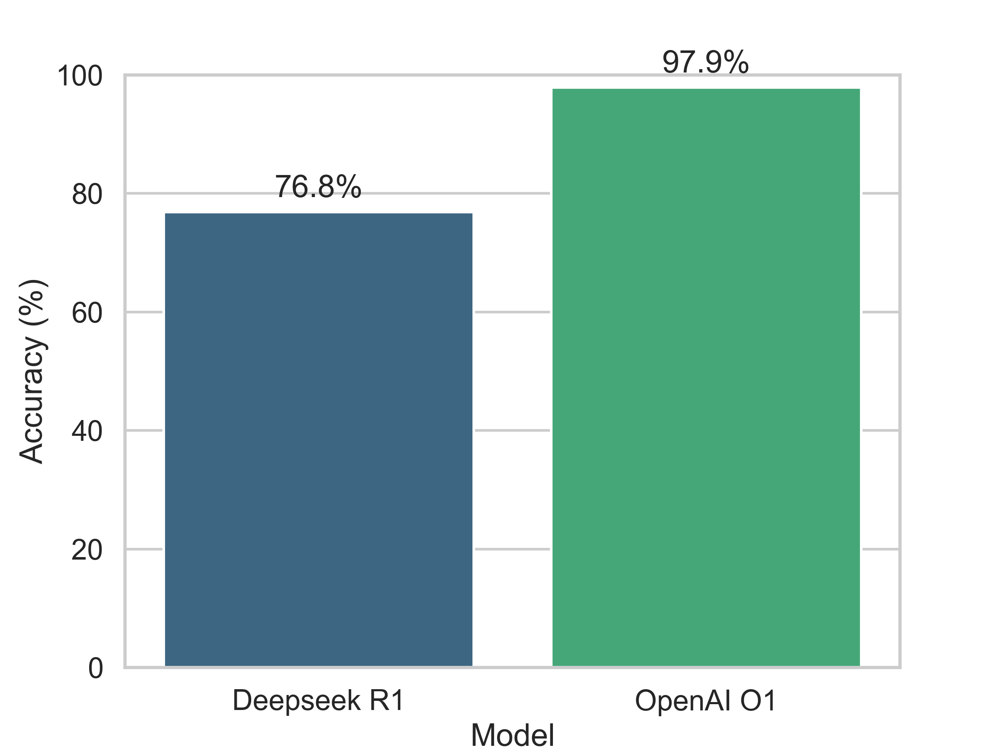

# R1 vs. O1: A Comparative Evaluation Using High School AP Calculus AB-Level Derivative Problems

This Python script compares the performance of two AI models (DeepSeek and OpenAI) on mathematical derivative problems.

## Results


## Features
- Uses the `seed_math_deepmind` dataset for testing
- Implements exponential backoff retry for API calls
- Processes mathematical questions and collects model responses
- Saves results to CSV for analysis

## Requirements
- Python 3.x
- OpenAI API key
- DeepSeek API key
- Required packages: openai, datasets, backoff, python-dotenv, pandas

## Setup
1. Create a `.env` file with:
    ```
    OPENAI_API_KEY=your_openai_key
    DeepSeek_API_Key=your_deepseek_key
    ```
2. Install dependencies
3. Run the script

## Output
Results are saved to `model_comparison_results.csv` with columns:
- question
- correct_answer
- deepseek_answer
- o1_answer
